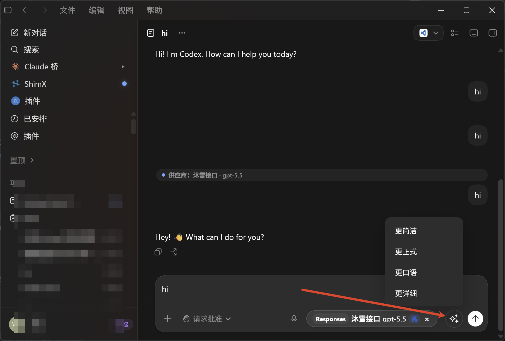

<div align="center">
  
  <h1>ShimX</h1>
  <p>面向 Codex Desktop 的本地增强器</p>
  <p>
    <a href="README_cn.md"><strong>简体中文</strong></a>
    ·
    <a href="README_en.md">English</a>
  </p>
  <p>
    
    =3.9" />
    
    
    
  </p>
</div>

ShimX 是一个面向 Codex Desktop 的本地增强器。它用 Flutter 构建桌面端管理界面,通过 Chrome DevTools Protocol 注入 Codex 页面,并在本机提供反向代理、MCP server、会话管理、用户脚本和 Codex Skills/Plugins 管理能力。

## 官方中转站

<p align="center">
  <a href="https://muxueai.pro">
    
  </a>
</p>

## 赞助商

<p align="center">
  <a href="https://muxueai.pro"></a><br />
  <a href="https://fhl.mom"></a><br />
  <a href="https://gptcodex.top"></a>
</p>

## 快速浏览

- **页面增强**: Codex 浮层、供应商 / 模型选择器、输入框润色。
- **本地代理**: 多供应商、协议转换、测速、自动切换。
- **会话与备份**: Codex / Claude 会话读取、导入导出、删除与备份。
- **扩展生态**: 用户脚本、MCP、Skills、Plugins。

## 特色功能

### Codex 页面增强

<table>
  <tr>
    <td width="36%"></td>
    <td valign="top"><strong>供应商 / 模型选择器</strong><br />在输入区旁直接切换供应商、模型、协议和思考深度,并查看实时延迟。</td>
  </tr>
  <tr>
    <td width="36%"></td>
    <td valign="top"><strong>输入框润色</strong><br />选择更简洁、更正式、更口语或更详细,先预览原文与润色后文本,确认后再替换输入内容。</td>
  </tr>
  <tr>
    <td width="36%"></td>
    <td valign="top"><strong>Codex 内浮层控制面板</strong><br />注入后在 Codex 页面内查看 Bridge 状态、当前供应商、自动切换策略和上下文映射。</td>
  </tr>
</table>

### 会话与上下文

<table>
  <tr>
    <td width="36%"></td>
    <td valign="top"><strong>Claude Bridge</strong><br />把本地 Claude Code 会话绑定到 Codex thread,通过 MCP 读取历史上下文继续对话。</td>
  </tr>
  <tr>
    <td width="36%"></td>
    <td valign="top"><strong>会话导入 / 导出 / 删除</strong><br />在 Codex 项目菜单中导入 JSONL/ZIP,导出 Markdown、HTML 或原始数据,并支持安全删除。</td>
  </tr>
  <tr>
    <td width="36%"></td>
    <td valign="top"><strong>单条会话操作</strong><br />在 Codex 侧栏会话菜单中直接导出 Markdown、HTML、原始数据或删除当前会话。</td>
  </tr>
</table>

### 自动切换与扩展

<table>
  <tr>
    <td width="36%"></td>
    <td valign="top"><strong>自动切换与工具过滤</strong><br />配置故障转移、最快优先、慢响应阈值、同家模型策略,并按关键词过滤工具。</td>
  </tr>
  <tr>
    <td width="36%"></td>
    <td valign="top"><strong>用户脚本编辑器</strong><br />内置 JavaScript 编辑器,支持 metadata、自动保存、热运行、运行时刷新和控制台入口。</td>
  </tr>
  <tr>
    <td width="36%"></td>
    <td valign="top"><strong>Codex 插件解锁</strong><br />从镜像、GitHub 或本地 ZIP 安装 curated plugin marketplace,并写入 Codex 配置。</td>
  </tr>
</table>

### 桌面管理

<table>
  <tr>
    <td width="36%"></td>
    <td valign="top"><strong>脚本列表与批量管理</strong><br />在主窗口中查看脚本 metadata,并批量启用、禁用、删除或导入脚本。</td>
  </tr>
  <tr>
    <td width="36%"></td>
    <td valign="top"><strong>桌面端设置中心</strong><br />统一管理语言、主题、主题色、快捷方式、工具过滤、官方登录和代理接管端口。</td>
  </tr>
</table>

## 核心能力

### Codex 页面注入

- 自动启动或连接 Codex Desktop,默认使用调试端口 `9229`。
- 通过 CDP 注入内置 `codex_enhance` 脚本和用户启用的脚本。
- 在 Codex 页面中增加 ShimX 徽章、侧栏入口、控制面板、日志面板、插件面板、供应商/模型选择器、Claude Bridge、会话导出/删除入口、项目菜单增强和润色按钮。
- 注入侧通过 `window.shimx(path, payload)` 与 Flutter 侧桥接;用户脚本可使用 `window.shimxApi`。详见 [用户脚本手册](docs/user_script_manual_zh.md) / [User Script Manual](docs/user_script_manual_en.md)。

### API 供应商与本地代理

- 管理多个上游供应商,包括名称、Base URL、API Key、协议、模型列表、选中模型和权重。
- 支持 `responses`、`chat`、`messages` 三类上游协议,并把 Codex 的 Responses 请求转换到对应上游协议。
- 本机反向代理监听 `127.0.0.1:<port>`,接管时会把 Codex `~/.codex/config.toml` 的当前 `base_url` 改成本地代理地址。
- 接管前会保留 `config.toml` 和 `auth.json` 快照,用于处理 Codex 官方登录切换导致配置被擦写的情况。
- 支持供应商测速、健康状态、失败统计、慢响应检测、工具过滤关键词和模型 reasoning effort 覆盖。
- 自动切换策略包括手动、故障转移和最快优先,支持同类型/同协议/任意范围、失败阈值、冷却时间、后台测速周期、慢响应阈值和同家模型 fallback。

### 会话管理

- Codex 会话:
  - 读取 `~/.codex/state_5.sqlite` 和 rollout JSONL。
  - 按项目、线程和 `model_provider` 桶浏览会话。
  - 查看 normalized 消息详情,包含用户消息、助手消息、工具调用和工具结果。
  - 支持导出 Markdown、HTML 和原始 JSONL。
  - 支持导入单个 JSONL 或 ZIP 包。
  - 支持删除会话,删除前会在应用支持目录写入备份。
  - 支持把会话移动到指定桶,或统一合并到 `shimx` 桶。
- Claude Code 会话:
  - 读取 `~/.claude/projects/<encoded-cwd>/*.jsonl`。
  - 按项目和会话浏览 Claude Code 历史。
  - 支持详情查看和 Markdown/原始 JSONL 导出。
  - 可通过 Claude Bridge 绑定到 Codex thread,让代理注入系统提示并引导上游模型通过 MCP 读取对应 Claude 会话上下文。
- 备份库:
  - 将选中的 Codex 会话备份到 `<AppSupport>/codex_session_backups/`。
  - 备份包含 `manifest.json`、`sqliteRows.json` 和 rollout JSONL 副本。
  - 支持单条/整批恢复和删除备份。

### MCP

- 内置 Streamable HTTP MCP server,监听 `127.0.0.1:<port>/mcp`。
- 内置 Claude 会话工具:
  - `list_claude_sessions`
  - `read_claude_session`
  - `search_claude_session`
- MCP server 可按持久化开关自动启动,并可写入/移除 Codex `config.toml` 的 `[mcp_servers.*]` 配置。
- 高级 MCP 配置页可编辑 ShimX 管理的 Codex MCP 配置块,支持启用/禁用、保存和删除。

### 用户脚本

- 在 ShimX 首页管理注入到 Codex 页面的 `.js` 脚本。
- 支持导入、创建、编辑、删除、启用/禁用、批量操作。
- 脚本保存在应用支持目录的 `scripts/` 下。
- 编辑器支持自动保存、运行时刷新、热运行、手册查看和 Codex DevTools 控制台入口。
- 脚本 metadata 使用 `// ==ShimX==` 块解析,缺失时会按文件名生成默认信息。

### Codex Skills

- 扫描并管理 `~/.codex/skills`。
- 支持从文件夹或 ZIP 安装 Skill。
- 支持把已有 Skill 导入 ShimX 管理。
- 只允许删除 ShimX 管理的 Skill,避免误删外部 Skill。
- 安装记录保存在本地 registry 中,并计算内容 hash 用于识别变更。

### Codex Plugins

- 支持安装 OpenAI curated plugin marketplace 到 Codex Home 下的临时插件目录。
- 支持从远端 ZIP、本地 ZIP 或本地目录安装。
- 安装后会把 marketplace 配置写入 Codex `config.toml`。
- 注入侧提供插件运行时兼容层和插件面板入口。

### 桌面体验与设置

- 支持系统托盘:显示窗口、启动 Codex 并注入、退出 ShimX。
- 关闭窗口默认最小化到托盘。
- 可创建桌面快捷方式,快捷方式会用 `--launch-codex` 启动 ShimX,自动启动 Codex 并注入后隐藏到托盘。
- 支持简体中文/英语、系统/浅色/深色主题、主题色设置。
- 支持打开源码仓库、创建快捷方式、开启官方登录配置、管理工具过滤关键词。
- 应用内日志支持按等级过滤、复制和清空。

## 工作机制

ShimX 的运行链路可以概括为:

1. Flutter 应用启动,初始化窗口、托盘、主题、本地化和持久化配置。
2. 如果代理或 MCP 开关处于启用状态,启动对应本地服务。
3. 用户点击注入或通过快捷方式启动时,ShimX 启动/连接 Codex Desktop,并确保 Codex 开启远程调试端口。
4. ShimX 通过 CDP 连接 Codex 页面,注册 Dart 侧 bridge 路由,注入 `bridge_bootstrap.js`、内置增强脚本和用户脚本。
5. Codex 页面中的注入脚本通过 bridge 调用 Flutter 侧功能,例如供应商切换、会话读取、导出、日志、插件和 Claude Bridge。
6. 开启接管后,Codex 请求会先到 ShimX 本机代理,再由代理按选中供应商、协议和模型转发到真实上游。

## 项目结构

```text
lib/
  main.dart                         Flutter 入口
  common/                           通用页面、窗口托盘 bootstrap、共享组件
  core/
    routes/                         go_router 路由
    services/                       CDP、Bridge、代理、MCP、托盘、快捷方式等核心服务
    providers/                      全局 Riverpod provider
    themes/                         主题、字体、颜色
    utils/                          协议、TOML、导出、脚本 metadata 等工具
  features/
    home/                           主界面、注入编排、侧栏
    providers/                      API 供应商、代理配置、测速、自动切换
    codex_session/                  Codex 会话读取、导出、导入、删除、桶移动
    claude_session/                 Claude Code 会话读取和导出
    codex_backup/                   Codex 会话备份库
    mcp/                            MCP server 和 Codex MCP 配置
    scripts/                        用户脚本管理和编辑器
    skills/                         Codex Skills 管理
    plugins/                        Codex Plugins marketplace 安装
    logs/                           应用日志面板
    settings/                       设置页
assets/
  inject/                           注入到 Codex 页面的 JS
  inject/codex_enhance/             Codex 页面增强分片
  docs/                             应用内手册资源
docs/                               项目文档
test/                               单元测试
```

## 开发

环境要求:

- Flutter SDK,当前 `pubspec.yaml` 使用 Dart SDK `^3.9.2`。
- Windows 或 macOS。
- 本机已安装 Codex Desktop。Windows 通过 `OpenAI.Codex*` UWP 包启动,macOS 默认查找 `/Applications/Codex.app`。

常用命令:

```bash
flutter pub get
dart run build_runner watch --delete-conflicting-outputs
flutter run -d windows
flutter test
```

macOS 调试时把运行目标换成:

```bash
flutter run -d macos
```

项目使用 Riverpod Generator、Freezed 和 JSON Serializable,日常开发建议保持 `build_runner watch` 运行。

## 构建与打包

### Windows Release

先构建 Flutter Windows release:

```powershell
flutter build windows --release
```

产物目录:

```text
build\windows\x64\runner\Release\
```

这个目录必须完整保留,包括 `shimx.exe`、`flutter_windows.dll`、插件 DLL、`data/` 和 `native_assets.json`。

### Windows MSI 安装包

ShimX 使用 WiX Toolset 生成标准 Windows Installer `.msi`。打包脚本位于:

```text
tool\build_windows_msi.ps1
```

安装前置工具:

```powershell
dotnet tool install --global wix
& "$env:USERPROFILE\.dotnet\tools\wix.exe" eula accept wix7
& "$env:USERPROFILE\.dotnet\tools\wix.exe" extension add WixToolset.UI.wixext
```

如果机器没有 .NET SDK,先安装 SDK 后再安装 WiX。没有 `winget` 时可使用 Microsoft 官方 `dotnet-install.ps1` 安装到用户目录。

生成 MSI:

```powershell
powershell -ExecutionPolicy Bypass -File .\tool\build_windows_msi.ps1 -AcceptWix7Eula
```

默认会生成两个本地化 MSI:

```text
dist\ShimX-1.0.0-x64-zh-CN.msi
dist\ShimX-1.0.0-x64-en-US.msi
```

如只生成单一语言:

```powershell
powershell -ExecutionPolicy Bypass -File .\tool\build_windows_msi.ps1 -AcceptWix7Eula -Cultures zh-CN
powershell -ExecutionPolicy Bypass -File .\tool\build_windows_msi.ps1 -AcceptWix7Eula -Cultures en-US
```

- `dist/`、`.tmp/` 和 `.wix/` 是本地打包产物或缓存,不会进入版本控制。

### macOS 打包

Flutter macOS 不能在 Windows 本机交叉编译。macOS 包必须在 macOS + Xcode 环境构建,可以使用实体 Mac、云 Mac 或 GitHub Actions/Codemagic 的 macOS runner。

在 macOS 上构建 release:

```bash
flutter build macos --release
```

产物:

```text
build/macos/Build/Products/Release/shimx.app
```

生成标准 `.pkg` 安装器:

```bash
mkdir -p dist
productbuild \
  --component build/macos/Build/Products/Release/shimx.app /Applications \
  dist/ShimX-1.0.0.pkg
```

公开分发给普通用户时还需要 Apple Developer ID 签名和公证:

```bash
codesign --deep --force --options runtime --sign "Developer ID Application: <Name>" shimx.app
productbuild --sign "Developer ID Installer: <Name>" ...
xcrun notarytool submit ... --wait
xcrun stapler staple ...
```

常见用户分发也可以制作 `.dmg`,但严格的 macOS 标准安装器是 `.pkg`。

## 重要数据位置

- Codex Home: 优先使用 `CODEX_HOME`,否则默认 `~/.codex`。
- Codex 配置: `~/.codex/config.toml`。
- Codex 数据库: `~/.codex/state_5.sqlite`。ShimX 当前使用的是 Codex Home 根目录下这份库,不是 `~/.codex/sqlite/state_5.sqlite`。
- Codex 会话 JSONL: `~/.codex/sessions/<yyyy>/<mm>/<dd>/rollout-*.jsonl`。
- Claude Code 会话: `~/.claude/projects/**/*.jsonl`。
- ShimX 用户脚本: `<AppSupport>/scripts/`。
- ShimX Codex 会话备份: `<AppSupport>/codex_session_backups/`。
- 接管快照: `~/.codex/.shimx_takeover_backup/`。
- Codex Skills: `~/.codex/skills/`。

## 注意事项

- ShimX 会按用户操作修改 `~/.codex/config.toml`,尤其是代理接管、MCP 配置和插件 marketplace 配置。修改前后建议确认 Codex 未在关键请求中。
- Codex 会话删除、导入、桶移动和备份恢复会写 `state_5.sqlite` 与 rollout JSONL。虽然代码里做了备份和事务,但这类操作仍建议在 Codex 空闲时执行。
- 用户脚本运行在 Codex 页面上下文中,应避免覆盖 `window.shimxApi`、全局 patch `fetch`/`XMLHttpRequest` 或修改内置原型。
- 代理只监听 loopback 地址,不会对外网开放服务。

## License

本项目使用 [GPL-3.0](LICENSE) 许可证。
