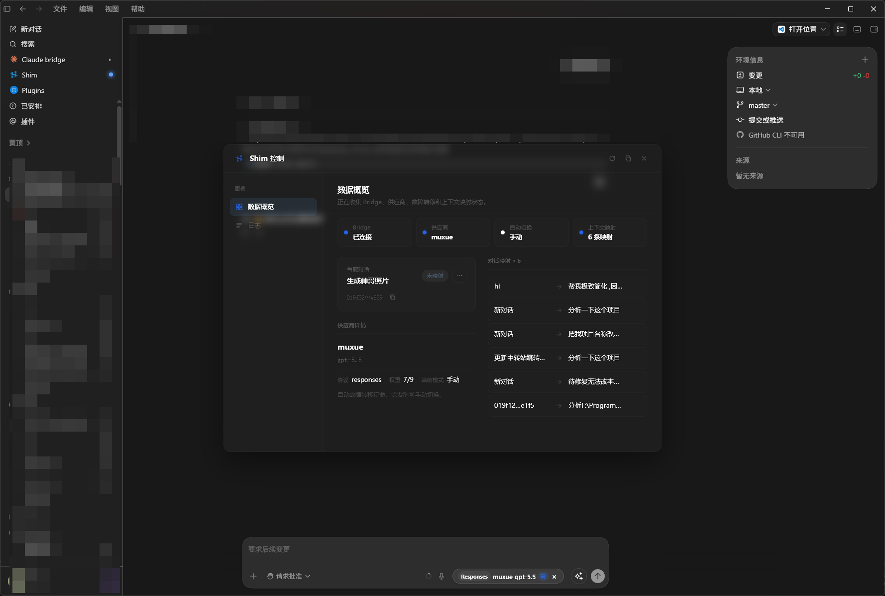
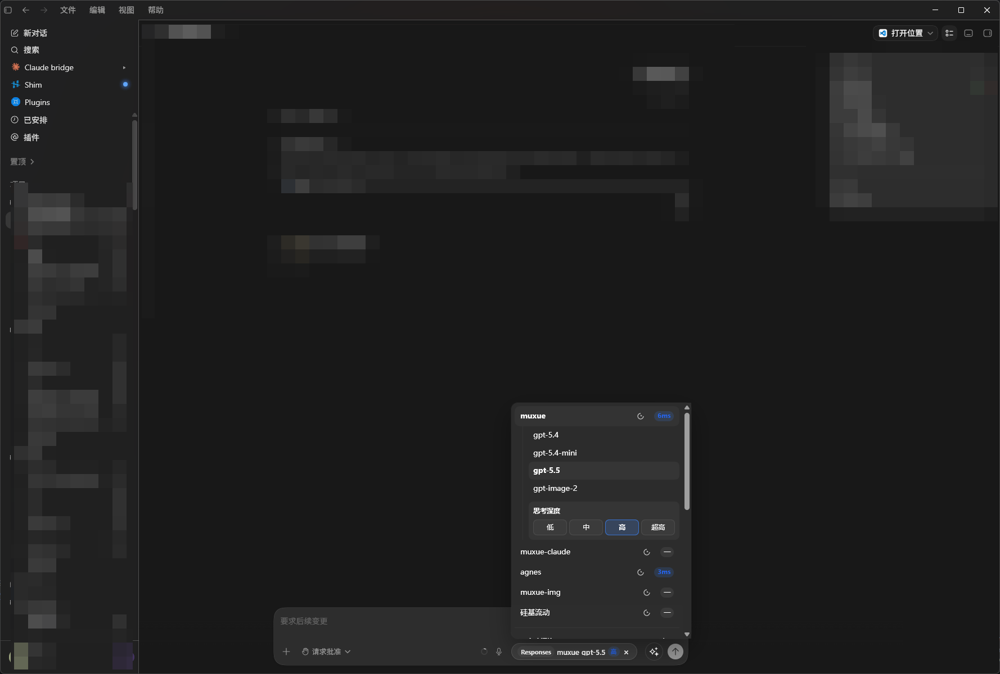
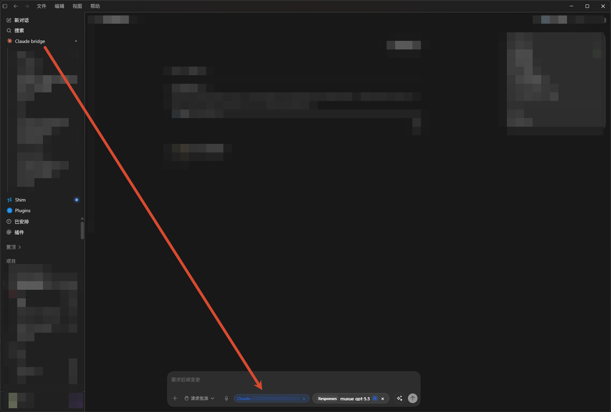
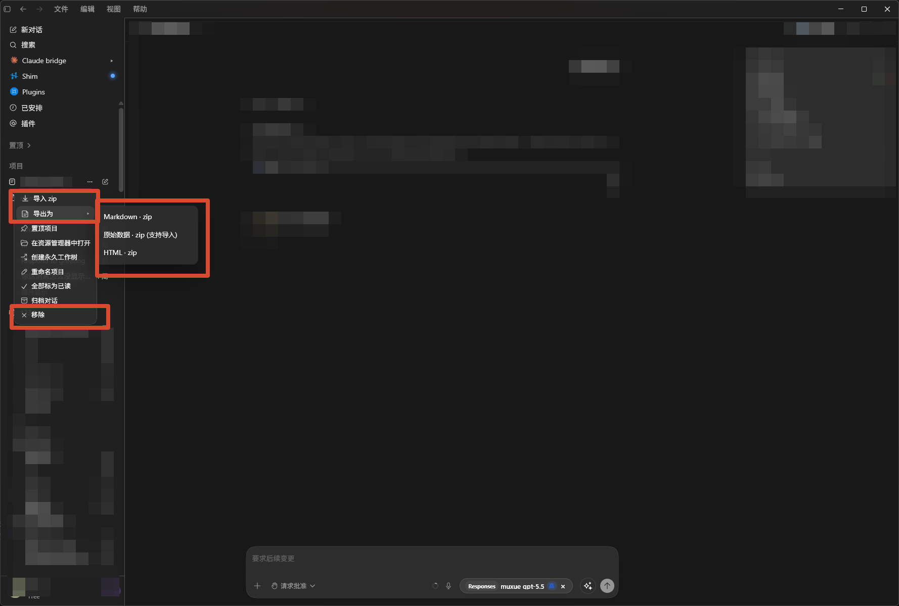
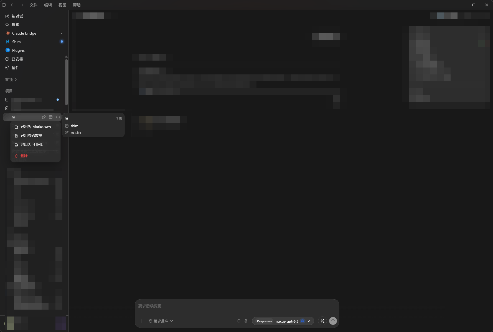
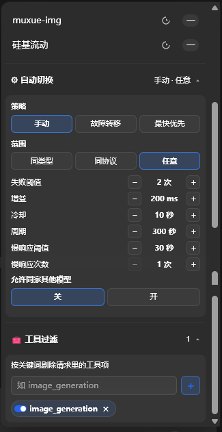
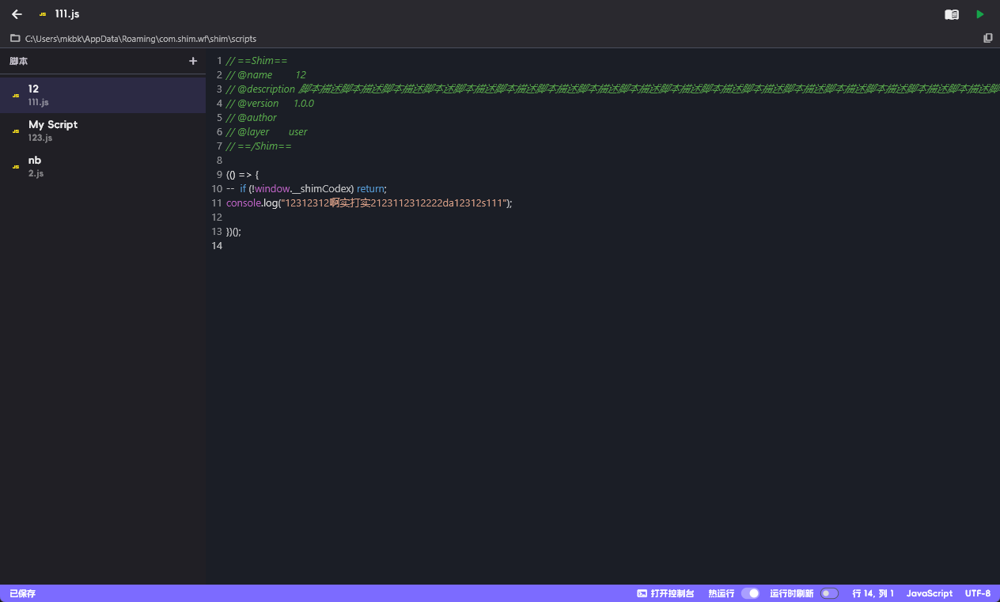
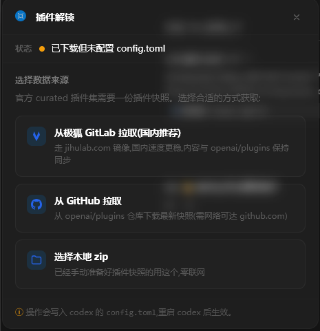
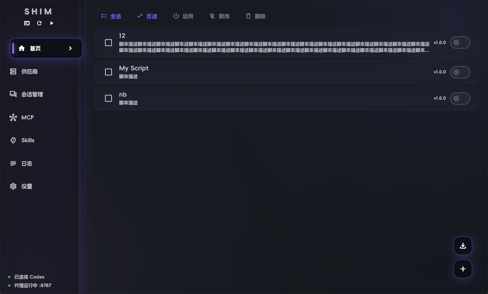
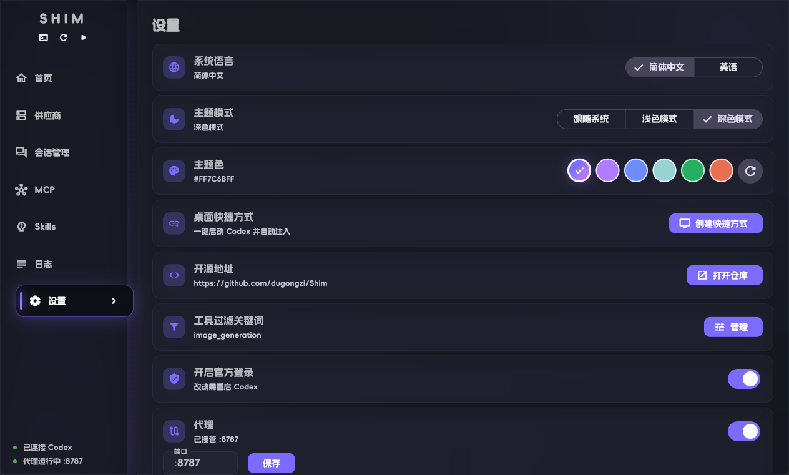

<div align="center">
  
  <h1>ShimX</h1>
  <p>A local enhancer for Codex Desktop</p>
  <p>
    
    =3.9" />
    
    
    
  </p>
</div>

ShimX is a local enhancer for Codex Desktop. It provides a Flutter-based desktop management UI, injects enhancements into the Codex page through Chrome DevTools Protocol, and runs local services for reverse proxying, MCP, session management, user scripts, Codex Skills, and Codex Plugins.

Repository: <https://github.com/dugongzi/ShimX>

<p align="center">
  <a href="README_cn.md">简体中文</a> |
  <strong>English</strong>
</p>

## Feature Highlights

<table>
  <tr>
    <td width="50%">
      
      <p><strong>In-Codex Control Panel</strong><br />After injection, inspect Bridge state, the current provider, auto-switch strategy, and context bindings directly inside Codex.</p>
    </td>
    <td width="50%">
      
      <p><strong>Provider / Model Picker</strong><br />Switch providers, models, protocols, and reasoning effort beside the composer, with live latency indicators.</p>
    </td>
  </tr>
  <tr>
    <td width="50%">
      
      <p><strong>Claude Bridge</strong><br />Bind a local Claude Code session to a Codex thread and let MCP read its history as continuation context.</p>
    </td>
    <td width="50%">
      
      <p><strong>Session Import / Export / Delete</strong><br />Import JSONL/ZIP, export Markdown, HTML, or raw data, and safely delete sessions from the Codex project menu.</p>
    </td>
  </tr>
  <tr>
    <td width="50%">
      
      <p><strong>Single-Session Actions</strong><br />Export Markdown, HTML, raw data, or delete the current session directly from the Codex sidebar thread menu.</p>
    </td>
    <td width="50%">
      
      <p><strong>Auto Switch And Tool Filtering</strong><br />Configure failover, fastest-first switching, slow-response thresholds, sibling fallback, and keyword-based tool filtering.</p>
    </td>
  </tr>
  <tr>
    <td width="50%">
      
      <p><strong>User Script Editor</strong><br />Built-in JavaScript editor with metadata, autosave, hot run, reload-on-run, and DevTools console access.</p>
    </td>
    <td width="50%">
      
      <p><strong>Codex Plugin Unlock</strong><br />Install the curated plugin marketplace from a mirror, GitHub, or local ZIP, then register it in Codex config.</p>
    </td>
  </tr>
  <tr>
    <td width="50%">
      
      <p><strong>Script List And Batch Management</strong><br />View script metadata in the main window and batch enable, disable, delete, or import scripts.</p>
    </td>
    <td width="50%">
      
      <p><strong>Desktop Settings Center</strong><br />Manage language, theme, theme color, shortcut, tool filtering, official login, and proxy takeover port in one place.</p>
    </td>
  </tr>
</table>

## Core Capabilities

### Codex Page Injection

- Launch or connect to Codex Desktop, using debug port `9229` by default.
- Inject built-in `codex_enhance` scripts and enabled user scripts through CDP.
- Add the ShimX badge, sidebar entry, control panel, logs panel, plugin panel, provider/model picker, Claude Bridge, session export/delete actions, project menu enhancements, and prompt polish button to the Codex page.
- The injected page communicates with Flutter through `window.shimx(path, payload)`. User scripts can use `window.shimxApi`. See [User Script Manual](docs/user_script_manual_en.md) / [用户脚本手册](docs/user_script_manual_zh.md).

### API Providers And Local Proxy

- Manage multiple upstream providers, including name, Base URL, API Key, protocol, model list, selected model, and weights.
- Support `responses`, `chat`, and `messages` upstream protocols, converting Codex Responses requests to the selected upstream protocol.
- Run a local reverse proxy on `127.0.0.1:<port>`. When takeover is enabled, ShimX rewrites the active `base_url` in Codex `~/.codex/config.toml` to the local proxy URL.
- Capture `config.toml` and `auth.json` snapshots before takeover, which helps recover from Codex official-login flows that may rewrite those files.
- Support latency probing, provider health state, failure streaks, slow-response detection, tool-filter keywords, and reasoning effort overrides.
- Auto-switch strategies include manual, failover, and fastest-first, with configurable scope, thresholds, cooldown, probe interval, slow-response thresholds, and same-provider sibling fallback.

### Session Management

- Codex sessions:
  - Read `~/.codex/state_5.sqlite` and rollout JSONL files.
  - Browse sessions by project, thread, and `model_provider` bucket.
  - View normalized message details, including user messages, assistant messages, tool calls, and tool results.
  - Export as Markdown, HTML, or raw JSONL.
  - Import a single JSONL file or a ZIP bundle.
  - Delete sessions with a backup written before deletion.
  - Move sessions to a target bucket, or merge all buckets into the `shimx` bucket.
- Claude Code sessions:
  - Read `~/.claude/projects/<encoded-cwd>/*.jsonl`.
  - Browse Claude Code history by project and session.
  - View session details and export as Markdown or raw JSONL.
  - Bind a Claude session to a Codex thread through Claude Bridge. The proxy injects a system instruction that asks the upstream model to read the bound Claude session via MCP before answering.
- Backup library:
  - Back up selected Codex sessions into `<AppSupport>/codex_session_backups/`.
  - Each backup includes `manifest.json`, `sqliteRows.json`, and rollout JSONL copies.
  - Restore one session, restore all sessions, or delete a backup.

### MCP

- Run a built-in Streamable HTTP MCP server at `127.0.0.1:<port>/mcp`.
- Built-in Claude session tools:
  - `list_claude_sessions`
  - `read_claude_session`
  - `search_claude_session`
- The MCP server can auto-start from persisted settings and can register/unregister itself in Codex `config.toml` under `[mcp_servers.*]`.
- The advanced MCP config page can edit ShimX-managed Codex MCP config blocks, including enable/disable, save, and delete actions.

### User Scripts

- Manage `.js` scripts injected into the Codex page from the ShimX home tab.
- Import, create, edit, delete, enable/disable, and batch-manage scripts.
- Scripts are stored in the app support directory under `scripts/`.
- The editor supports autosave, reload-on-run, hot run, manual access, and a Codex DevTools console entry.
- Script metadata is parsed from the `// ==ShimX==` block. Missing metadata falls back to the filename.

### Codex Skills

- Scan and manage `~/.codex/skills`.
- Install a Skill from a folder or ZIP file.
- Import an existing Skill into ShimX management.
- Only ShimX-managed Skills can be deleted, which avoids deleting external Skills by mistake.
- Installation records are stored in a local registry, with content hashes used for change detection.

### Codex Plugins

- Install the OpenAI curated plugin marketplace into Codex Home's temporary plugin directory.
- Install from a remote ZIP, local ZIP, or local directory.
- Register the local marketplace in Codex `config.toml` after installation.
- Provide an injected plugin runtime compatibility layer and plugin panel entry.

### Desktop Experience And Settings

- System tray actions: show window, launch Codex and inject, quit ShimX.
- Closing the window hides it to the tray instead of quitting.
- Create a desktop shortcut. The shortcut launches ShimX with `--launch-codex`, automatically launches/injects Codex, then hides ShimX to the tray.
- Support Simplified Chinese / English, system / light / dark theme, and theme color settings.
- Open the source repository, create a shortcut, enable official-login config, and manage tool-filter keywords.
- In-app logs support level filtering, copying, and clearing.

## How It Works

ShimX's runtime flow is:

1. The Flutter app starts and initializes the window, tray, theme, localization, and persisted settings.
2. If proxy or MCP switches are enabled, ShimX starts the corresponding local services.
3. When the user clicks inject or starts through the shortcut, ShimX launches or connects to Codex Desktop and ensures the remote debug port is available.
4. ShimX connects to the Codex page through CDP, registers Dart-side bridge routes, and injects `bridge_bootstrap.js`, built-in enhancement scripts, and user scripts.
5. Injected scripts call Flutter-side features through the bridge, such as provider switching, session reading, export, logs, plugins, and Claude Bridge.
6. When takeover is enabled, Codex requests go to the local ShimX proxy first, then the proxy forwards them to the selected upstream provider using the selected protocol and model.

## Project Structure

```text
lib/
  main.dart                         Flutter entry
  common/                           Shared pages, window/tray bootstrap, common widgets
  core/
    routes/                         go_router routes
    services/                       CDP, Bridge, proxy, MCP, tray, shortcuts, and core services
    providers/                      Global Riverpod providers
    themes/                         Theme, fonts, colors
    utils/                          Protocol, TOML, export, script metadata utilities
  features/
    home/                           Main UI, injection orchestration, sidebar
    providers/                      API providers, proxy config, probing, auto-switching
    codex_session/                  Codex session read/export/import/delete/bucket moves
    claude_session/                 Claude Code session read/export
    codex_backup/                   Codex session backup library
    mcp/                            MCP server and Codex MCP config
    scripts/                        User script manager and editor
    skills/                         Codex Skills manager
    plugins/                        Codex Plugins marketplace installer
    logs/                           App logs panel
    settings/                       Settings page
assets/
  inject/                           JS injected into the Codex page
  inject/codex_enhance/             Codex page enhancement shards
  docs/                             In-app manual resources
docs/                               Project docs
test/                               Unit tests
```

## Development

Requirements:

- Flutter SDK. `pubspec.yaml` currently uses Dart SDK `^3.9.2`.
- Windows or macOS.
- Codex Desktop installed locally. Windows launches the `OpenAI.Codex*` UWP package; macOS looks for `/Applications/Codex.app`.

Common commands:

```bash
flutter pub get
dart run build_runner watch --delete-conflicting-outputs
flutter run -d windows
flutter test
```

For macOS, use:

```bash
flutter run -d macos
```

The project uses Riverpod Generator, Freezed, and JSON Serializable. During regular development, keep `build_runner watch` running.

## Important Data Locations

- Codex Home: `CODEX_HOME` first, otherwise `~/.codex`.
- Codex config: `~/.codex/config.toml`.
- Codex database: `~/.codex/state_5.sqlite`. ShimX currently uses this database in Codex Home root, not `~/.codex/sqlite/state_5.sqlite`.
- Codex session JSONL: `~/.codex/sessions/<yyyy>/<mm>/<dd>/rollout-*.jsonl`.
- Claude Code sessions: `~/.claude/projects/**/*.jsonl`.
- ShimX user scripts: `<AppSupport>/scripts/`.
- ShimX Codex session backups: `<AppSupport>/codex_session_backups/`.
- Takeover snapshot: `~/.codex/.shimx_takeover_backup/`.
- Codex Skills: `~/.codex/skills/`.

## Notes

- ShimX modifies `~/.codex/config.toml` based on user actions, especially proxy takeover, MCP config, and plugin marketplace config. It is best to make such changes while Codex is idle.
- Codex session delete, import, bucket move, and backup restore actions write `state_5.sqlite` and rollout JSONL files. The code uses backups and transactions where appropriate, but these operations should still be run while Codex is idle.
- User scripts run inside the Codex page context. Avoid overriding `window.shimxApi`, globally patching `fetch` / `XMLHttpRequest`, or modifying built-in prototypes.
- The proxy only listens on loopback and is not exposed to the network.

## License

This project is licensed under [GPL-3.0](LICENSE).
